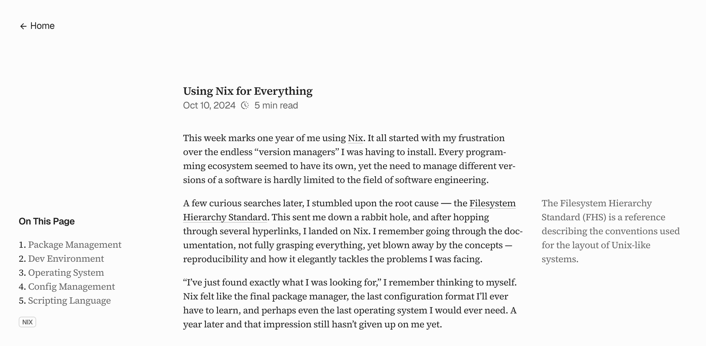

Source code powering [kyswtn.com](https://kyswtn.com) and my _public_ personal infrastructure.

Feel free to use this as a reference, but not a template. Copies about myself are about me, so you should rewrite them. Most if not all illustrations and assets are licensed and paid products, you may not use them. Some credentials are hard-coded, you must replace them.

The entire monorepo is massively reproducible and entirely declarative to the point with proper environment variables, just by renaming occurrences of my domain name, anyone could get the exact same personal infrastructure setup.

### Documentation

> In the beginning, there was a Nix flake.

In `./flake.nix` is a [devShell](https://wiki.nixos.org/wiki/Development_environment_with_nix-shell), entered immediately upon `cd` via [direnv](https://direnv.net). The shell loads environment variables and installs tools—among them, [Opentofu](https://opentofu.org). Opentofu, a fork of [Terraform](https://www.terraform.io), provisions infrastructure.

In the `./terraform` directory are a set of files, holding instructions to:

1. provision a [Cloudflare](https://www.cloudflare.com) [zone](https://developers.cloudflare.com/fundamentals/setup/accounts-and-zones),
2. update [Porkbun](https://porkbun.com) [nameservers](https://kb.porkbun.com/article/22-how-to-change-nameservers) to the new Cloudflare zone,
3. create a [Vercel](https://vercel.com) project linked to this repository, and
4. configure DNS records to route traffic to Vercel.

Terraform [state file](https://developer.hashicorp.com/terraform/language/state)—holding sensitive data—is stored in a [Cloudflare R2](https://www.cloudflare.com/developer-platform/products/r2) bucket via the [S3 backend](https://developer.hashicorp.com/terraform/language/backend/s3). To sidestep chicken-egg paradox, this R2 bucket is created manually, by a [wrangler](https://developers.cloudflare.com/workers/wrangler) script. All Terraform providers used are officially supported, except for Porkbun. I wrote [`terraform-provider-porkbun`](https://github.com/kyswtn/terraform-provider-porkbun).

Once provisioned, Vercel deploys the website from `./sites/www`. This repository, being a [Bun](https://bun.sh) [monorepo](https://monorepo.tools), manages all of `./sites/**`. During installation, a script clones `./notes` [submodule](https://git-scm.com/book/en/v2/Git-Tools-Submodules)—a private [Obsidian](https://obsidian.md) vault repository. This submodule is then loaded through [Astro](https://astro.build)'s [content collections](https://docs.astro.build/en/guides/content-collections) by the website. The website collects analytics through [Umami](https://github.com/umami-software/umami), self-hosted with [Docker Compose](https://docs.docker.com/compose) on a VPS.

The VPS is hosted on [Hetzner Cloud](https://www.hetzner.com/cloud) and entirely configured via [NixOS](https://nixos.org). HCloud lacks support for standard NixOS images therefore [Packer](https://packer.io) is used to create a NixOS [golden image](https://en.wikipedia.org/wiki/Disk_image) as a [snapshot](https://docs.hetzner.com/cloud/servers/backups-snapshots/overview). I wrote [create-hcloud-nixos-snapshot](https://github.com/kyswtn/create-hcloud-nixos-snapshot) for that. Generated `hardware-configuration.nix` is kept alongside other system configurations in `./nixos`.

Terraform provisions the VPS behind a [firewall](https://docs.hetzner.com/cloud/firewalls), only allowing Cloudflare's proxied traffic. This use Cloudflare's SSL/TLS (from Google's CA) as [edge certificates](https://developers.cloudflare.com/ssl/edge-certificates). [Let's Encrypt](https://letsencrypt.org) is then configured as origin certificates (required for to [Full(Strict)](https://developers.cloudflare.com/ssl/origin-configuration/ssl-modes/full-strict) mode on Cloudflare). The VPS's IPv4/6 are then added to Cloudflare's DNS. These steps can be listed as:

1. make a firewall and allow only Cloudflare IPs,
2. provision a server placed behind the firewall, and
3. configure DNS records to point to VPS's IP.

Once provisioned, the VPS is then configured remotely via [`nixos-rebuild`](https://wiki.nixos.org/wiki/Nixos-rebuild). On the first [SSH](https://www.openssh.com) session, [Tailscale](http://tailscale.com) is setup and SSH is promptly turned off. Tailscale’s [MagicDNS](https://tailscale.com/kb/1081/magicdns) binds the server to a hostname, avoiding the problem of having to remember IPs.

NixOS configurations setup [Docker](https://www.docker.com) and [Traefik](https://traefik.io/traefik). Traefik handles routing, SSL/TLS certificates, and load balancing with it's [Docker Provider](https://doc.traefik.io/traefik/reference/install-configuration/providers/docker). Its dashboard is made accessible at `traefik` subdomain only within Tailscale’s private network.

Many other services such as [Linkding](https://linkding.link) for bookmarks, [N8n](https://n8n.io) for automations etc. are implemented as [Docker Compose](https://docs.docker.com/compose) configuration files within `./sites`. Each service is configured either with [named external volumes](https://docs.docker.com/engine/storage/volumes) and handles it's own database backup or with [bind mounts](https://docs.docker.com/engine/storage/bind-mounts) within `/srv`. `/srv` is then backed up to Cloudflare R2 on a [daily basis](https://wiki.nixos.org/wiki/Systemd/timers/en) using [Restic](https://restic.net).
